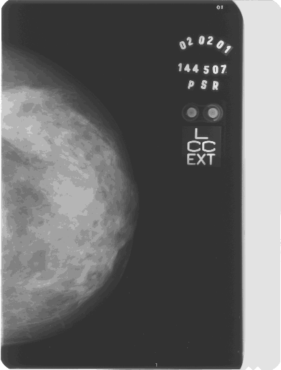
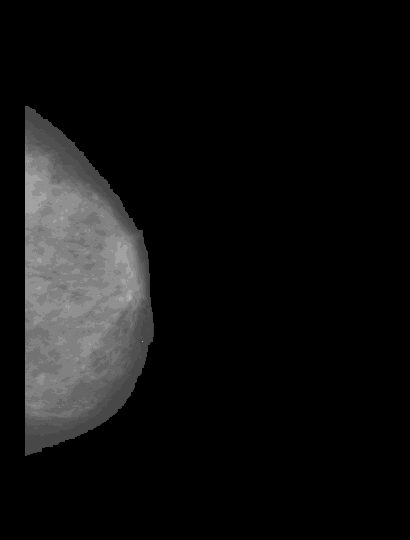
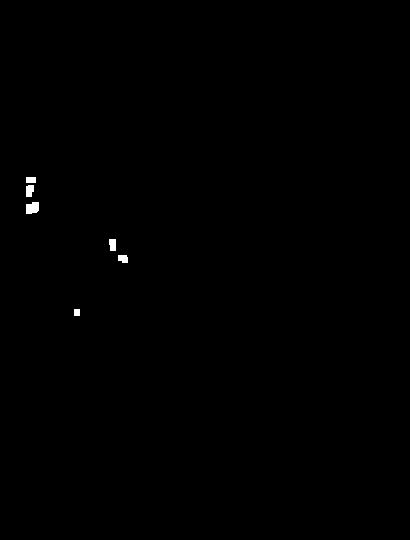
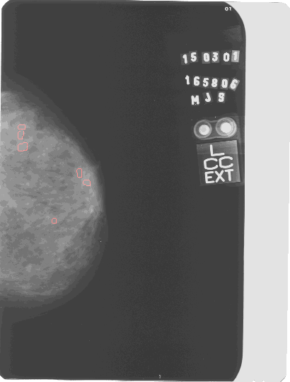

# Identificação e Classificação de Tumores de Mama
# Identification and Classification of Breast Tumors
## Apresentação
O presente projeto foi originado no contexto das atividades da disciplina de pós-graduação *EA979A - Introdução a Computação Gráfica e Processamento de Imagens*, oferecida no primeiro semestre de 2022, na Unicamp, sob supervisão da Profa. Dra. Paula Dornhofer Paro Costa, do Departamento de Engenharia de Computação e Automação (DCA) da Faculdade de Engenharia Elétrica e de Computação (FEEC).

| Nome |	RA |	Curso |
| --- |	--- |	--- |
| Igor Rando |	171959 |	Física Médica |

## Descrição do Projeto
O câncer de mama é o segundo tipo de câncer mais frequente no mundo e o primeiro entre mulheres. Devido à desinformação e à falta de acesso a exames adequados o câncer de mama ainda causa muitas mortes no Brasil.

Este projeto teve como motivação uma iniciação científica que o aluno participou e estudou redes neurais convolucionais e suas aplicações em imagens médicas. Como o foco da disciplina é o processamento de imagens e não o desenvolvimento de redes neurais, é uma boa oportunidade para explorar o outro lado de um projeto que foi realizado.

O objetivo deste projeto é estudar um meio de identificação de tumores na mama. Para isso, foram utilizados diversos métodos de processamento de imagens que auxiliaram nessa identificação. Um algoritmo foi desenvolvido e implementado para que, a partir de imagens mamográficas fornecidas, encontre e destaque nódulos na mama. A classificação desses nódulos é um adicional que será comentado apenas superficialmente para complementar o trabalho.

## Abordagem Adotada
### Base de Imagens
As imagens utilizadas foram obtidas através de um banco de dados pertencente ao Laboratório de Análise e Processamento de Imagens Médicas e Odontológicas (LAPIMO). Ele contém diversas imagens mamográficas que são compartilhadas entre pesquisadores e, para ter acesso a ela, foi necessário fazer um cadastro e pedir autorização. 

As mamografias fornecidas possuem alguns dados das pacientes e um breve laudo sobre os nódulos, como suas posições e características. Os históricos familiares também podem ser visualizados, facilitando a classificação dos nódulos.

### Processamento das Imagens
Depois de adquiridas as imagens, começaram os tratamentos para identificação de possíveis nódulos. O primeiro problema foi encontrado assim que o *download* da primeira imagem foi feito: por algum motivo, ao invés de baixar igual era apresentada no site, a imagem foi obtida com saturação, brilho e contraste extremamente alterados. É possível visualizar um exemplo no *folder* "*images*" com o nome "*1.png*" (não será colocada aqui devido a suas dimensões).

Alterada a saturação, a imagem foi reescalonada para facilitar a visualização no Google Colab (onde foi desenvolvido o *script*). A imagem abaixo é referente ao resultado desta etapa. Embora ela pareça com uma mamografia comum, é diferente da original e esse foi um dos maiores problemas. Mesmo o resultado final sendo satisfatório quando comparado com essa imagem, uma precisão maior seria atingida se a imagem original não tivesse que sofrer tais tratamentos para iniciar a identificação.

Em uma mamografia, os nódulos e as calcificações são as regiões mais claras da imagem, representando que são mais densas que o resto da mama. Tendo isso esclarecido, é possível iniciar a segmentação. Primeiramente, as etiquetas de identificação que ficam na imagem tiveram que ser retiradas, já que eram áreas claras que logicamente não representavam a mama. Em algumas imagens era possível visualizar os músculos peitorais da paciente, então também tiveram que ser removidos. Tudo isso foi feito com a adição de bordas.

Para padronizar e simplificar o *script*, apenas imagens da mama esquerda foram utilizadas, portanto, mesmo com tamanhos e formatos diferentes, as mamas sempre estavam em posições semelhantes, facilitando a segmentação. Com as bordas implementadas, foi aplicada uma limiarização global juntamente com um filtro para redução de ruído, resultando em uma imagem limpa e sem fundo. Pode-se notar que o contorno da mama ficou levemente danificado, no entanto, isso não é um problema já que o restante da mama se manteve intacto.

Para realçar os possíveis nódulos foi utilizado um filtro passa-alta, permitindo a passagem dos pixels com alta intensidade e reduzindo a intensidade do restante. O filtro utilizado foi retirado do trabalho de Borges, *Detecção de Agrupamentos de Microcalcificações em Imagens Mamográficas Digitais Utilizando Etapas de Segmentação da Mama e Realce*, no entanto, houve um estranhamento após sua aplicação. Talvez uma filtragem diferente tivesse resultados melhores, mas por falta de conhecimento na implementação dos filtros ele não foi alterado. O filtro em questão é descrito pela equação f = [-0.6  -0.4  3  -1].

Após isso, o contraste e o brilho da imagem tiveram que ser ajustados. Como cada imagem possuia uma intensidade diferente, esse processo teve que ser realizado manualmente. Outra fonte de erros talvez possa ser essa etapa. Como é um ajuste seletivo manual, o operador decide como quer o resultado, o que pode acarretar em uma imagem com contraste nada ideal.

Depois, teria que normalizar a imagem resultante e aplicar o filtro passa-alta novamente, no entanto, depois de diversas tentativas, não foi encontrado uma maneira de fazer isso. O problema foi que diversas bibliotecas do Python estavam sendo utilizadas no desenvolvimento do programa e a normalização sempre acabava estragando o resultado final. Logo, a normalização foi deixada de lado.

Com o filtro passa-alta aplicado pela segunda vez, uma outra limiarização foi realizada para remoção das partes escuras da mama. Novamente essa etapa teve que ser alterada de acordo com a imagem, isso porque o valor do limiar devia ser devidamente escolhido para que o resultado não tivesse pouca informação ou informação demais. Esse valor foi obtido através da tentativa e erro para cada imagem testada. Um exemplo pode ser visualizado abaixo.

Nesse exemplo o valor do limiar escolhido foi 135. No entanto, ainda havia informação demais na imagem. Para remover as regiões claras restantes, foi passada uma máscara para que apenas as regiões com maior concentração de pixels claros fossem mantidas. Diversos tamanhos de máscaras foram testados e, para quase todas as imagens, foi utilizada uma 6x6. A imagem resultante era a indicação dos agrupamentos.

Para facilitar a visualização e a comparação, foi passado um filtro de detecção de bordas. O utilizado foi o Canny simplesmente pela praticidade na implementação. O resultado foi convertido para RGB e suas cores foram alteradas para poder enxergar os agrupamentos sem dificuldades. Ao somar o resultado com a imagem inicial é obtido o resultado final e alguns exemplos serão ilustrados na seção Resultados Finais. A figura abaixo mostra o resultado do exemplo dado ao longo dessa seção.

Esta imagem em específico foi considerada como insastisfatória, dado que há áreas com maior intensidade que não foram consideradas como agrupamentos. Isso pode ter sido um erro acarretado pelo filtro utilizado que, como dito anteriormente, pode não ter sido a melhor escolha.

O *script* descrito nessa seção está disponível para visualização no notebook [Google Colab](https://colab.research.google.com/drive/1CEHYj5aE3Mj8Xfwpji4thSDZ1_H_UKzJ?usp=sharing,  "Google Colab").

### Classificação
Como este projeto foi desenvolvido para a disciplina de processamento de imagens, o foco deste trabalho já foi apresentado e descrito. No entanto, por curiosidade pessoal, um estudo sobre classificação de tumores de mama foi realizado e essa seção contém um resumo sobre tal.

Há diversos métodos e teorias que dizem como classificar um tumor de acordo com seu formato, portanto, foram escolhidos dois deles: a geometria fractal e a excentricidade da elipse. Existem diversas outras maneiras mais precisas para classificação, no entanto, estes foram os escolhidos por sua simplicidade e por poderem aproveitar de parte do algoritmo desenvolvido. Foi utilizado como base o artigo *Processamento de Imagens como Método na Diferenciação dos Tumores de Mama*, de Padilha.

A geometria fractal tem como características principais sua auto semelhança e alta complexidade. Ela é utilizada porque na maioria das vezes a Geometria Euclidiana não consegue analisar os tumores por possuírem estruturas altamente irregulares. O conceito de fractal é aplicado para estimar o tamanho do tumor, para isso é utilizado o método de *Box-Counting*.

Este método é comumente utilizado para calcular a dimensão dos fractais (na Geometria Euclidiana a dimensão é representada por um valor exato já na fractal os valores podem ser fracionados) e consiste em dividir a imagem em diversos quadrados. É feita a contagem do número de quadrados que contém pelo menos uma parte do tumor e sua dimensão é estimada. Este método pode ser realizado diversas vezes variando o tamanho dos quadrados e, quanto menor seu tamanho, maior sua quantidade. A estimativa da dimensão é baseada na relação entre o tamanho das caixas e o número delas que contém o tumor.

O próximo método consiste em calcular a elipse equivalente ao tumor. Definidas as bordas dos agrupamentos isso se torna fácil e é um processo relativamente simples, no entanto essa parte não será explicada por não ser o foco do projeto. Após a obtenção da elipse, a excentricidade dela é calculada. O valor varia entre 0 e 1 e, quando próxima a zero, a elipse tende para uma circunferência, já quando a excentricidade assume valores próximos a 1, a elipse fica mais achatada. Este método leva em consideração que tumores benignos tendem a ter formatos mais circulares, enquanto os malignos tendem para elipses.

Com ambos os métodos devidamente aplicados e tendo em mãos os dados da paciente, bem como seu histórico familiar, é possível analisar caso a caso e estimar um diagnóstico para os tumores. Lógicamente que isso não substitui o diagnóstico feito por um médico e, na maioria das vezes, a biópsia do tumor continua sendo necessária. Futuramente essas análises poderão ser mais precisas e a necessidade de procedimentos invasivos e desgastantes (como a biópsia) serão reduzidas.

## Resultados Finais
Foram realizados testes com 13 imagens para testar a eficiência do código em diferentes situações. Para um resultado ser considerado satisfatório ele deve indicar corretamente a existência de nódulos conforme o laudo e, para ser insatisfatório, não apontar nódulos ou apontar para regiões incorretas. Seguindo esse padrão, apenas duas das imagens testadas foram consideradas insatisfatórias e as outras 11 tiveram resultados satisfatórios.

Abaixo segue uma tabela com alguns dos testes realizados.

Imagens Iniciais  |  Imagens Finais
:-------------------------:|:-------------------------:
  |  
  |  
  |  
  |  
  |  
  |  

A primeira imagem foi uma das consideradas insatisfatórias, no entanto, todas as outras destacaram corretamente as regiões correspondentes a possíveis nódulos na mama, o que mostra a alta eficácia do algoritmo.

O baixo número de testes pode ser justificado pelo tempo levado para realizar o tratamento ideal de cada imagem. No entanto, é um bom número dadas as limitações do programa.

## Discussão
A alta taxa de sucesso do programa é um bom sinal, no entanto, houveram várias dificuldades durante seu desenvolvimento e sua implementação. O principal deles é que a imagem que o banco de dados disponibiliza para *download* não é a mesma imagem que exibem no laudo. Logo, para utilizá-la, foram necessários tratamentos prévios, o que alterou a qualidade da imagem e algumas informações originais foram perdidas.

O filtro passa-alta utilizado foi outro ponto de dificuldade e um bom tempo foi gasto desenvolvendo o *script* para aplicá-lo e tentando compreender seus resultados. O ajuste seletivo de contraste e brilho também foi algo insatisfatório: essa etapa serve para facilitar a visualização aos olhos humanos, no entanto, não houve um critério específico que foi levado em consideração. Houveram imagens em que o contraste foi aumentado e o resultado final foi satisfeito e houveram outras em que o contraste foi diminuído e o resultado também foi satisfeito, o que levanta a questão se essa etapa realmente era necessária ou foi realizada apenas para facilitar a visualização.

Como já citado, o programa possui diversas limitações e a principal é a irregularidade nas imagens. Existem diversos tamanhos e formatos de mama, o que dificulta na criação de um *script* perfeito para todas. Alguns filtros possuem valores estáticos e, como a posição da mama é um fator variável de acordo com o exame, tiveram que ser selecionadas imagens que satisfaziam certas condições.

Com melhores habilidades de programação talvez pudesse ser desenvolvido um algoritmo capaz de identificar os agrupamentos para qualquer imagem, porém, como o programa satisfaz os objetivos do projeto, não houve necessidade de alterações.

## Referências Bibliográficas
PADILHA, Renata Junges; CHICON, Patricia Mariotto Mozzaquatro; ANTONIAZZI, Rodrigo Luiz; DE LIMA, Claudinei. **Processamento de Imagens como Método na Diferenciação dos Tumores de Mama**. Revista Interdisciplinar de Ensino, Pesquisa e Extensão V.5 N.1 2017.

DA SILVA, Thayse Christine. **Detecção de Tumores em Mamografias via Processamento de Imagens**. São José, 2013.

LOPES, Daniel Soares; DA SILVA, Flávio Henrique; BONFIM, Matheus Ferreira. **Desenvolvimento do Algoritmo para Processamento
de Imagens Digitais para Diagnóstico de Melanoma**. Centro Universitário Católico Salesiano Auxilium, Araçatuba, 2013.

CRÓSTA, Á. P. **Processamento digital de imagens de sensoriamento remoto**. UNICAMP, Instituto de Geociencias, 1992.

SUDHARSHANA P.J. **Multiple instance learning for histopathological breast cancer image classification**. Indian Institute of Information Technology - D&M, Jabalpur, India, 2019.

DING, Jianrui. **Breast Ultrasound Image Classification Based on Multiple-Instance Learning**. J Digit Imaging, 2012.

CHENG, H.D.; SHAN, Juan; JU, Wen; GUO, Yanhui. **Automated breast cancer detection and classification using ultrasound images: A survey**. Department of Computer Science, Utah State University, Logan, 2010.

ZHUANG, Zhemin. **Breast ultrasound tumor image classification using image decomposition and fusion based on adaptive multi-model spatial feature fusion**. Department of Electronic Engineering, Shantou University, Shantou, Guangdong, China, 2021.

CHANDEL, Ruchika; GUPTA, Gaurav. **Image Filtering Algorithms and Techniques: A Review**. Computer Science Department Shoolini University (H.P), India, 2013.

LUKIN, Alexey. **Tips & Tricks: Fast Image Filtering Algorithms**. Department of Computational Mathematics and Cybernetics, Moscow State University, Moscow, Russia, 2007.

BEHRENBRUCH, CP; PETROUDI, S; BOND, S; DECLERCK, JD; LEONG, FJ; BRADY, JM. **Image filtering techniques for medical image post-processing: an overview**. Br J Radiol, 2004.

CHUDASAMA, Diya; PATEL, Tanvi; JOSHI, Shubham; PRAJAPATI, Ghanshyam I. **Image Segmentation using Morphological Operations**. Dept. of InformationTechnology, SVMIT Engineering College, Bharuch, India, 2015.

HASAN, Syed Mohammad Abid; KO, Kwanghee. **Depth edge detection by image-based smoothing and morphological operations**. School of Mechatronics, Gwangju Institute of Science and Technology, Gwangju, South Korea, 2016.

SPONTÓN, Haldo; CARDELINO, Juan. **A Review of Classic Edge Detectors**. Instituto de Ingeniería Eléctrica, Universidad de la República, Uruguay, 2015.

DHARAMPAL, Vikram Mutneja. **Methods of Image Edge Detection: A Review**. Shaheed Bhagat Singh State Technical Campus, Ferozepur, Punjab, India, 2015.

SAVANT, Shubhashree. **A Review on Edge Detection Techniques for Image Segmentation**. (IJCSIT) International Journal of Computer Science and Information Technologies, Vol. 5 (4), 2014.

HERSCHKOWITZ, Jason I. **Identification of conserved gene expression features between murine mammary carcinoma models and human breast tumors**. Genome Biol. 8, R76, 2007.

MAKANDAR, Aziz; HALALLI, Bhagirathi. **Image Enhancement Techniques using Highpass and Lowpass Filters**. Department of Computer Science, Karnataka State Women’s University, Vijayapur, 2015.

BORGES, V. R. P.; GULIATO, Denise. **Detecção de Agrupamentos de Microcalcificações em Imagens Mamográficas Digitais Utilizando Etapas de Segmentação da Mama e Realce**. Faculdade de Computação, Universidade Federal de Uberlândia, 2011.

GONZALES, Rafael; WOODS, Richard. **Digital Image Processing**. Pearson Education, 2008.
