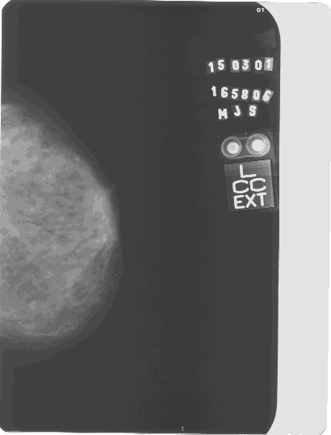

# Identificação e Classificação de Tumores de Mama
# Identification and Classification of Breast Tumors
## Apresentação
O presente projeto foi originado no contexto das atividades da disciplina de pós-graduação EA979A - Introdução a Computação Gráfica e Processamento de Imagens, oferecida no primeiro semestre de 2022, na Unicamp, sob supervisão da Profa. Dra. Paula Dornhofer Paro Costa, do Departamento de Engenharia de Computação e Automação (DCA) da Faculdade de Engenharia Elétrica e de Computação (FEEC).

| Nome |	RA |	Curso |
| --- |	--- |	--- |
| Igor Rando |	171959 |	Física Médica |

## Descrição do Projeto
O câncer de mama é o segundo tipo de câncer mais frequente no mundo e o primeiro entre mulheres. Devido à desinformação e à falta de acesso a exames adequados o câncer de mama ainda causa muitas mortes no Brasil.

Este projeto teve como motivação uma iniciação científica que o aluno participou que teve como objeto de estudo redes neurais convolucionais e suas aplicações em imagens médicas. Como o foco da disciplina é o processamento de imagens e não o desenvolvimento de redes neurais, é uma boa oportunidade para explorar o outro lado de um projeto que foi realizado.

O objetivo deste projeto é estudar um método de identificação de tumores na mama. Para isso, foram utilizados diversos métodos de processamento de imagens que auxiliaram nessa identificação. Um algoritmo foi desenvolvido e implementado para que, a partir de imagens mamográficas fornecidas, encontre e destaque nódulos na mama. A classificação desses nódulos é um adicional que será comentado apenas superficialmente para complementar o trabalho.

## Abordagem Adotada
### Base de Imagens
As imagens utilizadas foram obtidas através de um banco de dados pertencente ao Laboratório de Análise e Processamento de Imagens Médicas e Odontológicas (LAPIMO). Ele contém diversas imagens mamográficas que são compartilhadas entre pesquisadores e, para ter acesso a ela, foi necessário fazer um cadastro e pedir autorização. 

As mamografias fornecidas possuem alguns dados da paciente e, na maioria dos casos, um breve laudo sobre o nódulo, como a posição e suas características. O histórico familiar do paciente também pode ser visualizado, facilitanto a classificação dos nódulos.

### Processamentos Adotados
Depois de adquiridas as imagens, começaram os tratamentos para identificação de possíveis nódulos. O primeiro problema foi encontrado assim que o *download* da primeira imagem foi feito: por algum motivo, ao invés de baixar igual era apresentada no site, foi extraída uma imagem com saturação, brilho e contraste extremamente alterados. É possível visualizar um exemplo no *folder* "*images*" com o nome "*1.png*" (não será colocada aqui devido a suas dimensões).

Alterada a saturação, a imagem foi reescalonada para facilitar a visualização no Google Colab (onde foi desenvolvido o *script*). A imagem abaixo é referente ao resultado desta etapa. Embora ela pareça com uma mamografia comum, é diferente da original e esse foi um dos maiores problemas. Mesmo o resultado final sendo satisfatório quando comparado com essa imagem, uma precisão maior seria atingida se a imagem original não tivesse que sofrer tais tratamentos para iniciar a identificação.

Em uma mamografia, os nódulos e as calcificações são as regiões mais claras da imagem, representando que são mais densas que o resto da mama. Tendo isso esclarecido, é possível iniciar a segmentação. Primeiramente, as etiquetas de identificação que ficam na imagem tiveram que ser retiradas, já que eram áreas claras que logicamente não representavam a mama. Em algumas imagens era possível visualizar os músculos peitorais da paciente, então também tiveram que ser removidos. Tudo isso foi feito com a adição de bordas.

Para padronizar e simplificar o *script*, apenas imagens da mama esquerda foram utilizadas, portanto, mesmo com tamanhos e formatos diferentes, as mamas sempre estavam em posições semelhantes, facilitando a segmentação. Com as bordas implementadas, foi aplicada uma limiarização global juntamente com um filtro para redução de ruído, resultando em uma imagem limpa e sem fundo. Pode-se notar que o contorno da mama ficou levemente danificado, no entanto, isso não é um problema já que o restante da mama se manteve intacto.

Para realçar os possíveis nódulos foi utilizado um filtro passa-alta, permitindo a passagem dos pixels com alta intensidade e reduzindo a intensidade do restante. O filtro utilizado foi retirado do trabalho de Borges, *Detecção de Agrupamentos de Microcalcificações em Imagens Mamográficas Digitais Utilizando Etapas de Segmentação da Mama e Realce*, no entanto, houve um estranhamento após sua aplicação. Talvez uma filtragem diferente tivesse resultados melhores, mas por falta de conhecimento na implementação dos filtros ele não foi alterado. O filtro em questão é descrito pela equação f = [-0.6  -0.4  3  -1].

Após isso, o contraste e o brilho da imagem tiveram que ser ajustados. Como cada imagem possuia uma intensidade diferente, esse processo teve que ser realizado manualmente. Outra fonte de erros talvez possa ser essa etapa. Como é um ajuste seletivo manual, o operador decide como quer o resultado, o que pode acarretar em uma imagem com contraste nada ideal.

O ideal seria normalizar a imagem resultante e aplicar o filtro passa-alta novamente, no entanto, depois de diversas tentativas, não foi encontrado uma maneira de fazer isso. O problema foi que diversas bibliotecas do Python estavam sendo utilizadas no desenvolvimento do programa e a normalização sempre acabava estragando o resultado final. Logo, a normalização foi deixada de lado.

Com o filtro passa-alta aplicado pela segunda vez, uma outra limiarização foi realizada para remoção das partes escuras da mama. Novamente essa etapa teve que ser alterada de acordo com a imagem, isso porque o valor do limiar devia ser devidamente escolhido para que o resultado não tivesse pouca informação ou informação demais. Esse valor foi obtido através da tentativa e erro para cada imagem testada. Um exemplo pode ser visualizado abaixo.

## Resultados Finais
> Descrever e apresentar os resultados finais obtidos

## Discussão
> Discutir os resultados finais obtidos considerando-se o objetivo inicialmente proposto.
> Descrever as principais dificuldades enfrentadas na execução do projeto.
> Descrever limitações da abordagem adotada.

## Referências Bibliográficas
PADILHA, Renata Junges; CHICON, Patricia Mariotto Mozzaquatro; ANTONIAZZI, Rodrigo Luiz; DE LIMA, Claudinei. **Processamento de Imagens como Método na Diferenciação dos Tumores de Mama**. Revista Interdisciplinar de Ensino, Pesquisa e Extensão V.5 N.1 2017.

DA SILVA, Thayse Christine. **Detecção de Tumores em Mamografias via Processamento de Imagens**. São José, 2013.

LOPES, Daniel Soares; DA SILVA, Flávio Henrique; BONFIM, Matheus Ferreira. **Desenvolvimento do Algoritmo para Processamento
de Imagens Digitais para Diagnóstico de Melanoma**. Centro Universitário Católico Salesiano Auxilium, Araçatuba, 2013.

CRÓSTA, Á. P. **Processamento digital de imagens de sensoriamento remoto**. UNICAMP, Instituto de Geociencias, 1992.

SUDHARSHANA P.J. **Multiple instance learning for histopathological breast cancer image classification**. Indian Institute of Information Technology - D&M, Jabalpur, India, 2019.

DING, Jianrui. **Breast Ultrasound Image Classification Based on Multiple-Instance Learning**. J Digit Imaging, 2012.

CHENG, H.D.; SHAN, Juan; JU, Wen; GUO, Yanhui. **Automated breast cancer detection and classification using ultrasound images: A survey**. Department of Computer Science, Utah State University, Logan, 2010.

ZHUANG, Zhemin. **Breast ultrasound tumor image classification using image decomposition and fusion based on adaptive multi-model spatial feature fusion**. Department of Electronic Engineering, Shantou University, Shantou, Guangdong, China, 2021.

CHANDEL, Ruchika; GUPTA, Gaurav. **Image Filtering Algorithms and Techniques: A Review**. Computer Science Department Shoolini University (H.P), India, 2013.

LUKIN, Alexey. **Tips & Tricks: Fast Image Filtering Algorithms**. Department of Computational Mathematics and Cybernetics, Moscow State University, Moscow, Russia, 2007.

BEHRENBRUCH, CP; PETROUDI, S; BOND, S; DECLERCK, JD; LEONG, FJ; BRADY, JM. **Image filtering techniques for medical image post-processing: an overview**. Br J Radiol, 2004.

CHUDASAMA, Diya; PATEL, Tanvi; JOSHI, Shubham; PRAJAPATI, Ghanshyam I. **Image Segmentation using Morphological Operations**. Dept. of InformationTechnology, SVMIT Engineering College, Bharuch, India, 2015.

HASAN, Syed Mohammad Abid; KO, Kwanghee. **Depth edge detection by image-based smoothing and morphological operations**. School of Mechatronics, Gwangju Institute of Science and Technology, Gwangju, South Korea, 2016.

SPONTÓN, Haldo; CARDELINO, Juan. **A Review of Classic Edge Detectors**. Instituto de Ingeniería Eléctrica, Universidad de la República, Uruguay, 2015.

DHARAMPAL, Vikram Mutneja. **Methods of Image Edge Detection: A Review**. Shaheed Bhagat Singh State Technical Campus, Ferozepur, Punjab, India, 2015.

SAVANT, Shubhashree. **A Review on Edge Detection Techniques for Image Segmentation**. (IJCSIT) International Journal of Computer Science and Information Technologies, Vol. 5 (4), 2014.

HERSCHKOWITZ, Jason I. **Identification of conserved gene expression features between murine mammary carcinoma models and human breast tumors**. Genome Biol. 8, R76, 2007.

MAKANDAR, Aziz; HALALLI, Bhagirathi. **Image Enhancement Techniques using Highpass and Lowpass Filters**. Department of Computer Science, Karnataka State Women’s University, Vijayapur, 2015.

BORGES, V. R. P.; GULIATO, Denise. **Detecção de Agrupamentos de Microcalcificações em Imagens Mamográficas Digitais Utilizando Etapas de Segmentação da Mama e Realce**. Faculdade de Computação, Universidade Federal de Uberlândia, 2011.

GONZALES, Rafael; WOODS, Richard. **Digital Image Processing**. Pearson Education, 2008.
